<br><br><br>

| <center>学院       | <center>计算机与通信工程学院 |
| ------------------ | ---------------------------- |
| <center>**专业**   | <center>**计算机科学与技术** |
| <center>**班级号** | <center>**200523**           |
| <center>**学号**   | <center>**202012143**        |
| <center>**姓名**   | <center>**熊舟桐**           |

<br><br>

## Linux 基本命令

### 实验环境

本地 Linux 版本：Manjaro

```bash
Linux northboat-nhx0dbde 6.1.12-1-MANJARO #1 SMP PREEMPT_DYNAMIC Tue Feb 14 21:59:10 UTC 2023 x86_64 GNU/Linux
```

ssh 版本

```bash
OpenSSH_9.2p1, OpenSSL 3.0.8 7 Feb 2023
```

目标机版本：Debian

```bash
Linux VM-0-17-debian 5.10.0-19-amd64 #1 SMP Debian 5.10.149-2 (2022-10-21) x86_64 GNU/Linux
```

### 实验内容

#### ssh 连接 Linux

在`manjaro`上连接`debian`服务器

```bash
ssh root@43.163.218.127
```

查看主机基本信息


查看网卡信息

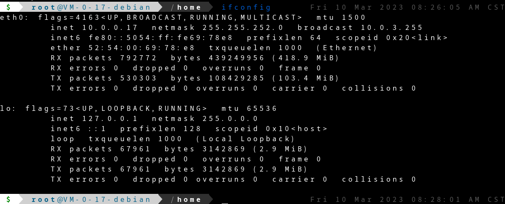

#### 文件管理命令

搜索文件

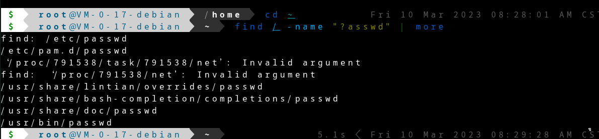

查看文件内容


通过管道过滤查找关键字

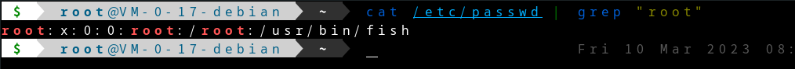

创建目录

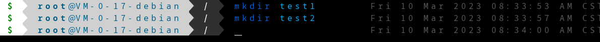

创建文本文件


编辑文件


复制文件

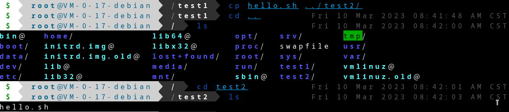

删除文件


删除目录

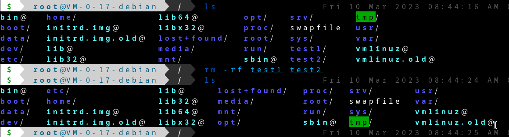

#### 用户管理

新建用户


切换并测试用户

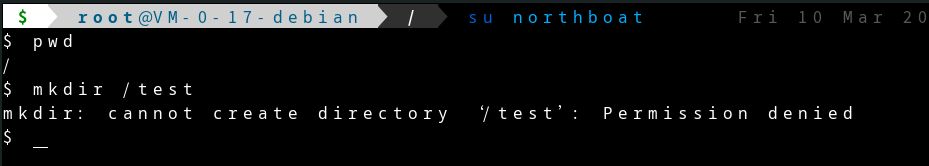


修改用户权限

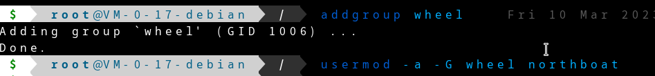

查看用户组

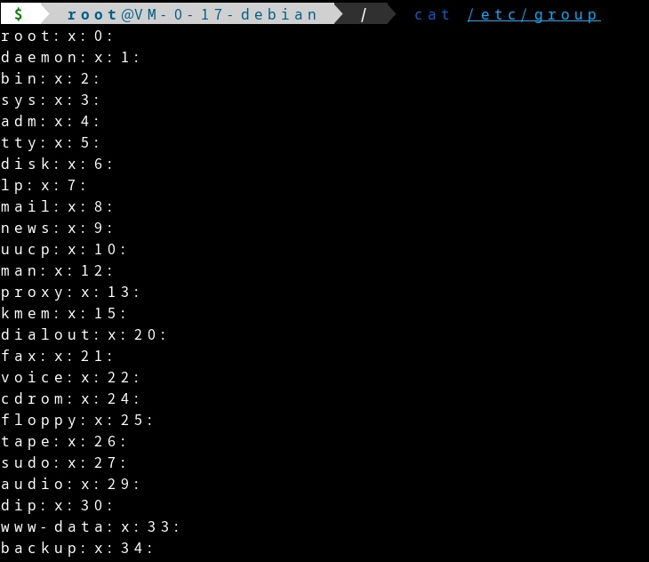

删除用户

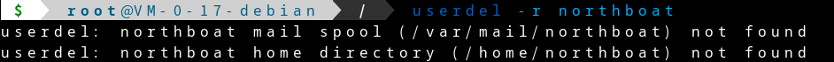

#### 文件解压缩

压缩文件`.tar`

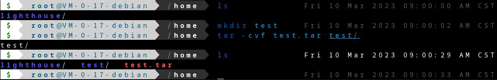

解压文件


压缩文件`.tar.gz`

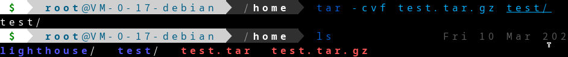

解压文件


### 实验总结

debain 默认没有 wheel 组，在加入用户进 wheel 组时会报错：group wheel does not exist

需要新增组

```bash
groupadd wheel
```

再将用户加入组

```bash
usermod -a -G wheel northboat
```

删除组

```bash
groupdel wheel
```

通过查看组`cat /etc/group`发现存在`root`组，将用户加入`root`组

```bash
usermod -a -G root northboat
```

## Linux 系统管理

### 实现环境

Linux 版本：Manjaro

```bash
Linux northboat-nhx0dbde 6.1.12-1-MANJARO #1 SMP PREEMPT_DYNAMIC Tue Feb 14 21:59:10 UTC 2023 x86_64 GNU/Linux
```

本地 Shell

### 实验内容

#### 网络管理

> 设置静态 IP，manjaro 下，使用 netctl 实现

下载 netctl

```bash
yay -S netctl
```

查看网卡信息

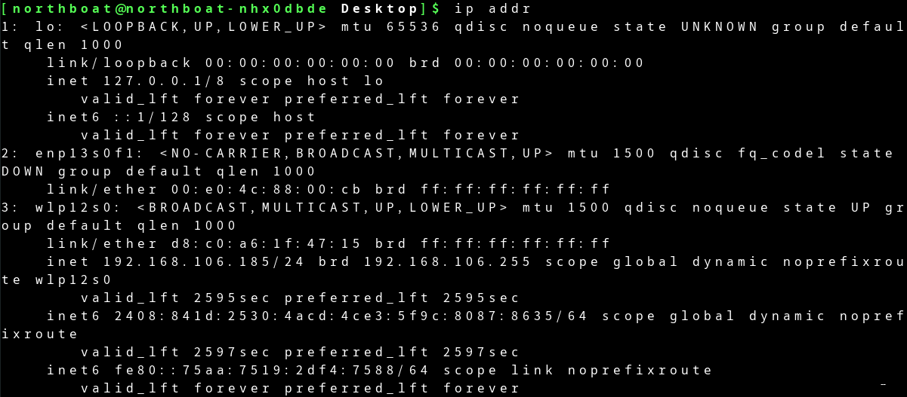

得知网卡名称`wlp12s0`

终止网络服务

```bash
sudo systemctl stop NetworkManager
sudo systemctl disable NetworkManager
```

复制`netctl`默认配置文件

```bash
sudo cp /etc/netctl/examples/ethernet-static /etc/netctl/enp13s0f1
```

编辑文件`wlp12s0`


配置 DNS 解析


重启网络服务

```bash
sudo systemctl start NetworkManager
sudo systemctl enable NetworkManager
```

查看网络连接状态

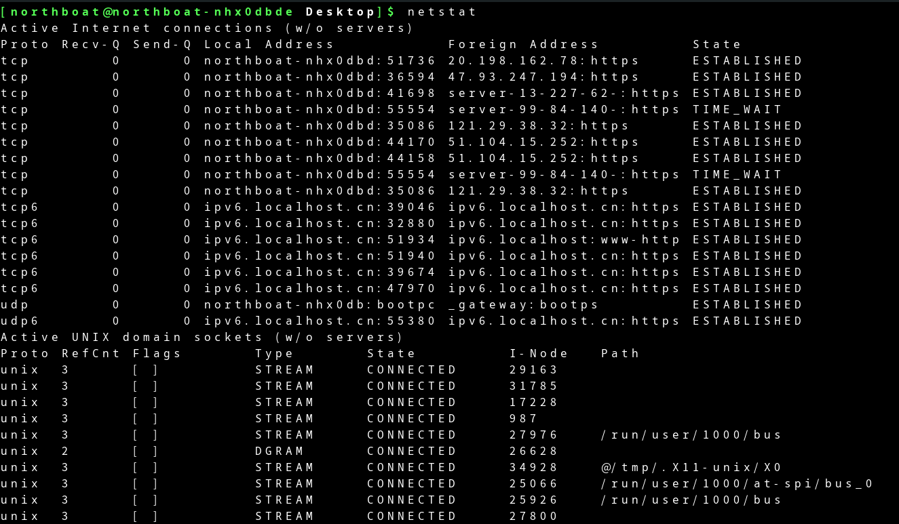

ping  通

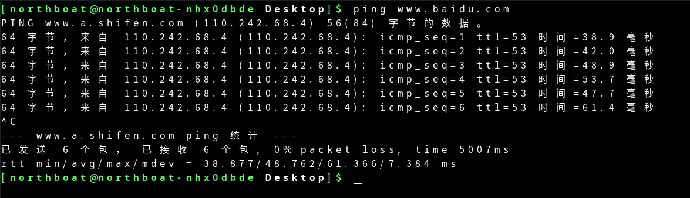

#### 进程管理

`ps`命令查看进程

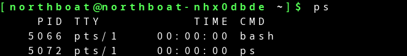

查看所有用户所有进程信息

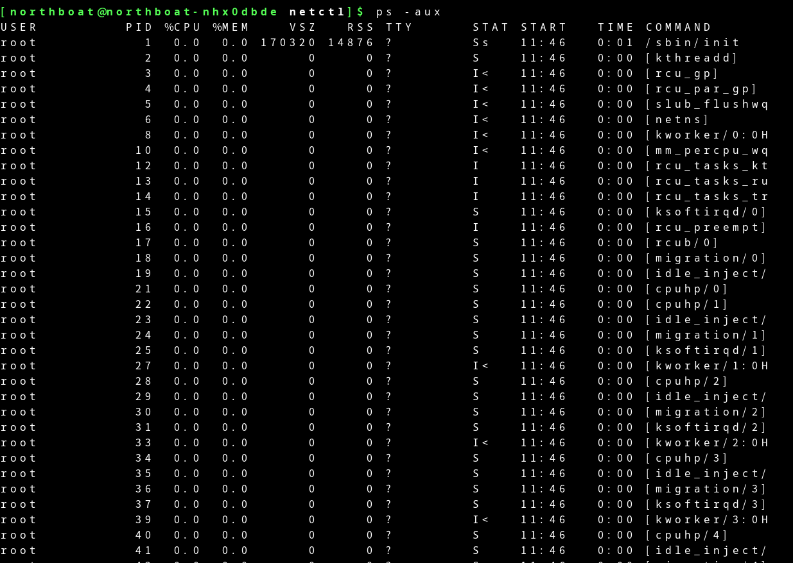

进程信息排序

- 按内存占用


- 按 CPU 占用


动态查看进程信息


终止进程

```bash
# 根据 pid 杀死进程
kill -9 pid

# 根据进程名查找 pid
pgrep -f name

# 根据进程名杀死进程
pkill -f name
```

#### 磁盘管理

查看已挂载磁盘总容量、已使用、剩余容量


查看目录或文件所占空间


### 实验总结

对于个人用户，修改静态 IP 便于在局域网内访问机器，之前使用系统提供的配置文件对静态 IP 进行过修改，但每次重启或重新联网后都会重置该 IP，后采用`netctl`对静态 IP 进行统一管理，解决问题

## Linux 服务器配置

### 实现环境

centos7

```bash
Linux VM-0-17-centos 3.10.0-1160.88.1.el7.x86_64 #1 SMP Tue Mar 7 15:41:52 UTC 2023 x86_64 x86_64 x86_64 GNU/Linux
```

ssh

### 实验内容

#### 下载 Nginx 服务器

通过 wget 在 nginx 官网下载

```bash
wget http://nginx.org/download/nginx-1.17.6.tar.gz 
```

安装必要依赖

```bash
yum -y install gcc pcre pcre-devel zlib zlib-devel openssl openssl-devel
```

创建目录

```bash
mkdir /usr/local/nginx
```

解压 nginx 压缩包

```bash
tar -zxvf nginx-1.17.6.tar.gz -C /usr/local/nginx
```

编译 nginx

```bash
cd /usr/local/nginx/nginx-1.17.6
./configure
make
make install
```

启动 nginx

```bash
cd /usr/local/nginx
./nginx
```

查看启动情况，浏览器进入`http://43.163.218.127/`

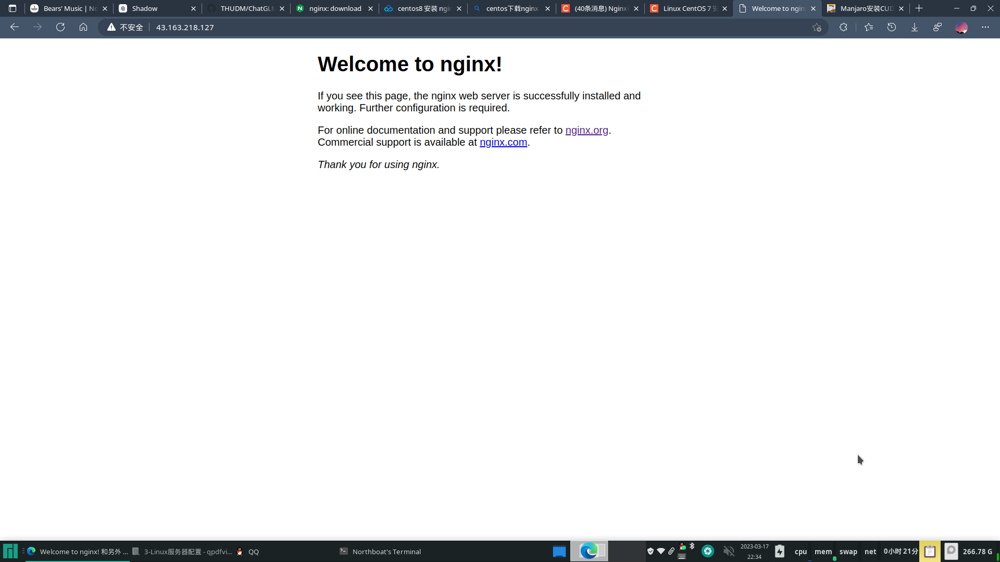

#### 下载 MariaDB

通过 yum 安装

```bash
yum install mariadb-server
```

启动 mariadb

```bash
systemctl start mariadb  # 开启服务
systemctl enable mariadb  # 设置为开机自启动服务
```

数据库配置

```bash
mysql_secure_installation
```

```bash
Enter current password for root (enter for none):  # 输入数据库超级管理员root的密码(注意不是系统root的密码)，第一次进入还没有设置密码则直接回车

Set root password? [Y/n]  # 设置密码，y

New password:  # 新密码
Re-enter new password:  # 再次输入密码

Remove anonymous users? [Y/n]  # 移除匿名用户， y

Disallow root login remotely? [Y/n]  # 拒绝root远程登录，n，不管y/n，都会拒绝root远程登录

Remove test database and access to it? [Y/n]  # 删除test数据库，y：删除。n：不删除，数据库中会有一个test数据库，一般不需要

Reload privilege tables now? [Y/n]  # 重新加载权限表，y。或者重启服务也许
```

登录

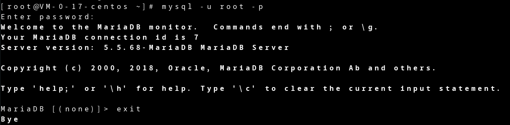

#### 下载 Redis

wget 下载

```bash
wget https://github.com/redis/redis/archive/redis-7.0.9.tar.gz
```

解压

```bash
tar -zvxf redis-7.0.9.tar.gz -C /usr/local/redis
```

编译

```bash
cd /usr/local/redis/redis/redis-7.0.9
make
```

安装

```bash
make PREFIX=/usr/local/redis install
```

复制默认配置文件

```bash
cp redis.conf ../bin
```

设置 redis.conf

```bash
requirepass 123456 # 设置密码
daemonize yes # 允许后台运行
bind 0.0.0.0 # 允许远程访问
```

启动

```bash
cd /usr/local/redis/bin
./redis-server redis.conf
```

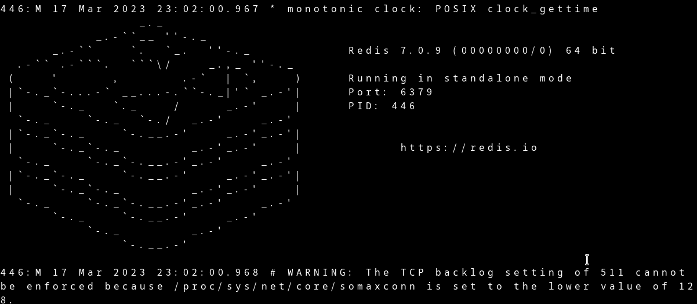

#### 安装 OpenJDK17

wget 下载最新的 jdk17

```bash
wget https://download.oracle.com/java/17/latest/jdk-17_linux-x64_bin.tar.gz
```

解压

```bash
tar xf jdk-17_linux-x64_bin.tar.gz
```

移动位置

```bash
mv jdk-17.0.6/ /usr/lib/jvm/jdk-17.0.6
```

修改环境配置

```bash
vim /etc/profile
```

添加以下内容

```bash
export JAVA_HOME=/usr/lib/jvm/jdk-17.0.6
export CLASSPATH=$JAVA_HOME/lib:$JRE_HOME/lib:$CLASSPATH
export PATH=$JAVA_HOME/bin:$JRE_HOME/bin:$PATH
```

重新加载配置

```bash
source /etc/profile
```

测试安装

```bash
java -version
```

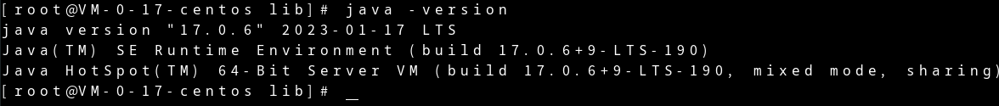

#### 安装 RabbitMQ

安装 Erlang 环境，yum 下载

安装依赖

```bash
curl -s https://packagecloud.io/install/repositories/rabbitmq/erlang/script.rpm.sh | sudo bash
```

下载 erlang

```bash
yum install -y erlang
```

测试安装

```bash
erl -version
```

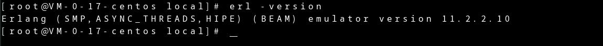

安装 RabbitMQ

导入 key

```bash
rpm --import https://packagecloud.io/rabbitmq/rabbitmq-server/gpgkey
rpm --import https://packagecloud.io/gpg.key
```

安装依赖

```bash
curl -s https://packagecloud.io/install/repositories/rabbitmq/rabbitmq-server/script.rpm.sh | sudo bash
```

wget 下载 rabbitmq

```bash
wget https://github.com/rabbitmq/rabbitmq-server/releases/download/v3.8.5/rabbitmq-server-3.8.5-1.el7.noarch.rpm
```

直接安装将报错

```bash
rpm -ivh rabbitmq-server-3.8.5-1.el7.noarch.rpm

warning: rabbitmq-server-3.8.5-1.el7.noarch.rpm: Header V4 RSA/SHA256 Signature, key ID 6026dfca: NOKEY
error: Failed dependencies:
	socat is needed by rabbitmq-server-3.8.5-1.el7.noarch
```

导入 key

```bash
rpm --import https://www.rabbitmq.com/rabbitmq-release-signing-key.asc
```

安装 socat

```bash
yum -y install epel-release
yum -y install socat
```

重新安装

```bash
rpm -ivh rabbitmq-server-3.8.5-1.el7.noarch.rpm
```

启用 rabbitmq 插件

```bash
rabbitmq-plugins enable rabbitmq_management
```

启动 rabbitmq

```bash
systemctl start rabbitmq-server
```

创建用户

```bash
rabbitmqctl add_user admin 011026
```

设置超级管理员权限

```bash
rabbitmqctl set_user_tags admin administrator
```

重启 rabbitmq

```bash
systemctl restart rabbitmq-server
```

查看可视化界面：`43.163.218.127:15672`

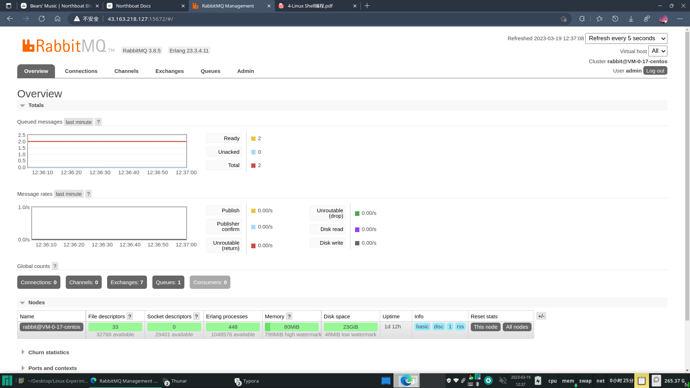

设置`virtual host`为`/`，默认为`ALL`

#### 服务器使用

使用 ftp 工具上传文件

- 一个前端网页
- 一个 jar 包

将 nginx 目录下 html 文件夹内容替换为上传的`index.html`，并将资源放在相应目录下

配置 nginx.conf 文件，设置端口及负载均衡

启动 jar 包

```bash
nohup java -jar Shadow-0.0.1-SNAPSHOT.jar &
```

访问`43.163.218.127:80`

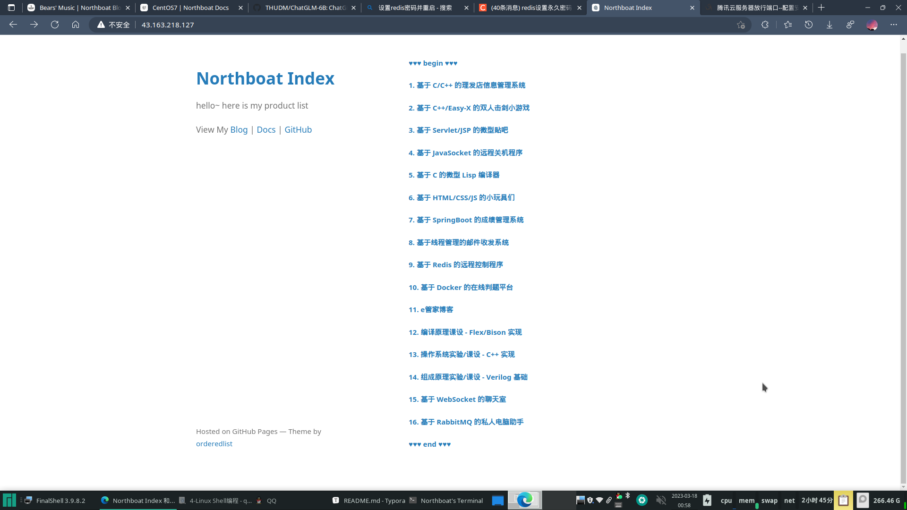

### 实验总结

通过部署安装`mysql、redis、rabbitmq、nginx`实现服务器环境搭建，成功跑通两个 Java 网页服务，使我对服务器的部署流程更加熟练

## Linux Shell 编程

### 实现环境

manjaro 本地 shell，内核版本

```bash
Linux northboat-nhx0dbde 6.1.12-1-MANJARO #1 SMP PREEMPT_DYNAMIC Tue Feb 14 21:59:10 UTC 2023 x86_64 GNU/Linux
```

### 实验内容

#### 第一个 Shell 脚本

hello.sh

```bash
echo "Hello World!"
```

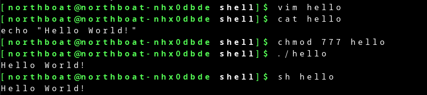

#### 利用脚本获取系统信息

```bash
echo System time: `date "+%Y-%m-%d %H:%M:%S"`
echo Running time: `uptime -p`
echo Load average: `cat /proc/loadavg | awk '{print $1,$2,$3}'`
totalMem=`free -h | grep 内存 | awk '{print $2}'`
usedMem=`free -h | grep 内存 | awk '{print $3}'`
echo used memory: $usedMem / $totalMem
```

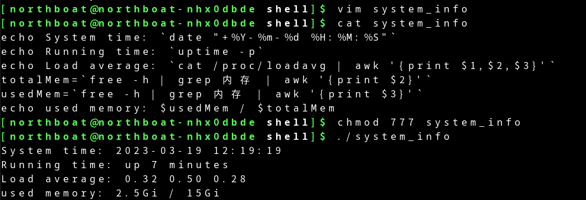

#### 获取网卡信息

network_monitor.sh

```bash
echo IP: `ifconfig wlp12s0 | grep -w inet | awk '{print $2}'`

# get receive bytes 10 seconds ago
inputBytes1=`cat /proc/net/dev | grep wlp12s0 | awk -F: '{print $2}' | awk '{print $1}'`

# get transmit bytes 10 seconds ago
outputBytes1=`cat /proc/net/dev | grep wlp12s0 | awk -F: '{print $2}' | awk '{print $9}'`

echo Input bytes1: $inputBytes1 Output bytes1: $outputBytes1

sleep 10

# get receive bytes 10s later
inputBytes2=`cat /proc/net/dev | grep wlp12s0 | awk -F: '{print $2}'|awk '{print $1}'`

# get transmit bytes 10s later
outputBytes2=`cat /proc/net/dev | grep wlp12s0 | awk -F: '{print $2}'|awk '{print $9}'`

echo Input bytes2: $inputBytes2 Output bytes2: $outputBytes2

# evaluate the network
if [ $inputBytes1 -le $inputBytes2 ]
	then
	echo Network traffic is on the rise.
 	else
 	echo Network traffic is on the falling.
fi
```

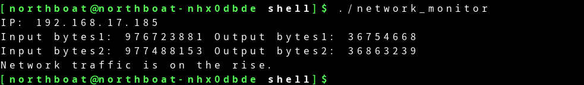

#### 监控 CPU 负载

cpu_monitor.sh

```bash
#Function: monitor load average of cpu, and write to file
if [ -f cpu_monitor.txt ]
	then
	touch cpu_monitor.txt
fi

# modify file permission
if [ -w cpu_monitor.txt ]
	then
	chmod 755 cpu_monitor.txt
fi

# write cpu infomation
cat /proc/cpuinfo | grep "model name" > cpu_monitor.txt
cat /proc/cpuinfo | grep "cpu cores" >> cpu_monitor.txt

echo " " >> cpu_monitor.txt
echo Total data: >> cpu_monitor.txt
echo user nice system idle iowait irq softirq >> cpu_monitor.txt

#write cpu infomation every 2s
for ((i=0;i<=50;i++))
	do
	cat /proc/stat | grep 'cpu ' | awk '{print $2" "$3" "$4" "$5" "$6" "$7" "$8}' >> cpu_monitor.txt
	sleep 2
done 
```


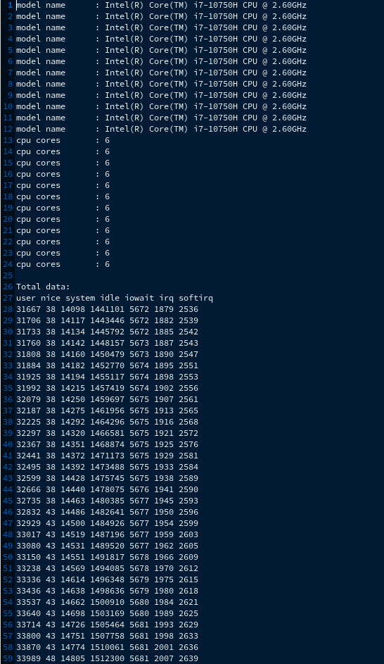

### 实验总结

注意添加空格，命令后一定要有，加参数后一定要有，否则报错很难找，通过本次实验，大大加强了我的 Shell 编程能力，对父子进程有一定的了解，并且在排错过程中增强了心态

## Linux 内核编译

### 实验环境

Vmware 虚拟机，Ubuntu16，为排除权限问题，本次实验命令均在`root`用户下执行

```bash
Linux ubuntu 4.15.0-112-generic #113~16.04.1-Ubuntu SMP Fri Jul 10 04:37:08 UTC 2020 x86_64 x86_64 x86_64 GNU/Linux
```

### 实验内容

#### 工具及环境准备

手动下载 Busybox，`apt`安装 QEMU 等工具

环境配置

```bash
apt-get install gcc qemu qemu-system-arm gcc-arm-linux-gnueabi libncurses5-dev build-essential flex bison bc
```

#### 编译最小文件系统

解压 busybox 至根目录，编译配置文件

```bash
tar -jxvf busybox-1.28.4.tar.bz2
cd /busybox-1.28.4
export ARCH=arm
export CROSS_COMPILE=arm-linux-gnueabi-
make menuconfig
```

在图形化界面进行内核配置：`settings - Build Options - [*]Build static binary(no shared libs)`

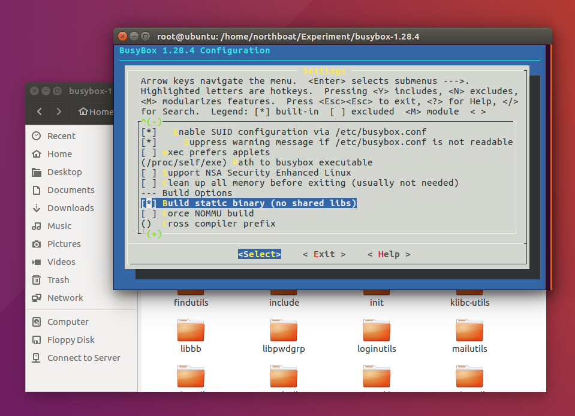

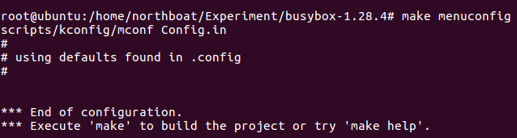

配置完成后，编译文件系统

```bash
make install
```

完成后会在目录下生成`_install`目录

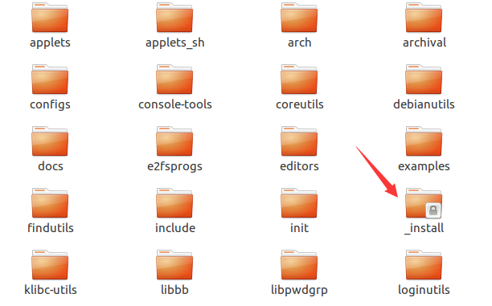

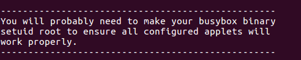

#### 编译内核

解压`Linux5.1`内核文件包，将`_install`拷入内核包的根目录，在`_install`下创建以下目录

```bash
mkdir etc
mkdir dev
mkdir mnt
mkdir –p etc/init.d
```

在`_install/etc/init.d`中创建文件`rcS`

```bash
mkdir -p /proc
mkdir -p /tmp
mkdir -p /sys
mkdir -p /mnt
/bin/mount -a
mkdir -p /dev/pts
mount -t devpts devpts /dev/pts
echo /sbin/mdev > /proc/sys/kernel/hotplug
mdev –s
```

修改该文件权限

```bash
chmod 755 rcS
```

在`_install/etc`下创建文件`fstab`

```bash
proc /proc proc defaults 0 0
tmpfs /tmp tmpfs defaults 0 0
sysfs /sys sysfs defaults 0 0
tempfs /dev tmpfs defaults 0 0
debugfs /sys/kernel/debug debugfs defaults 0 0
```

在`_install/etc`下创建文件`inittab`

```bash
::sysinit:/etc/init.d/rcS
::respawn:-/bin/sh
::askfirst:-/bin/sh
::ctrlaltdel:/bin/umount -a -r
```

在`_install/dev`下创建设备节点

```bash
mknod console c 5 1
mknod null c 1 3
```

完成设置后，在内核根目录中编译内核配置

```bash
export ARCH=arm
export CROSS_COMPILE=arm-linux-gnueabi-
make vexpress_defconfig
make menuconfig
```

完成以下设置

将`_install`填入`Initramfs source file`：位于`General setup - [*]Initial RAM filesystem and RAM disk (initramfs/initrd) support - (_install)Initramfs source file(s)`

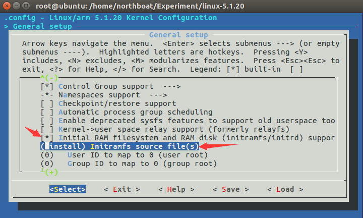

清空`Default kernel command string`：位于`Boot option - Default kernel command string`

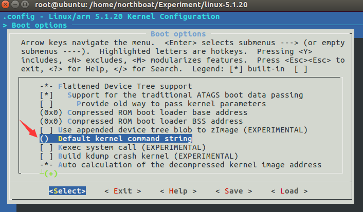

配置`memory split`并打开高内存支持：`Kernel features - Memory split(3G/1G user/kernel) & [*] High Memory Support`

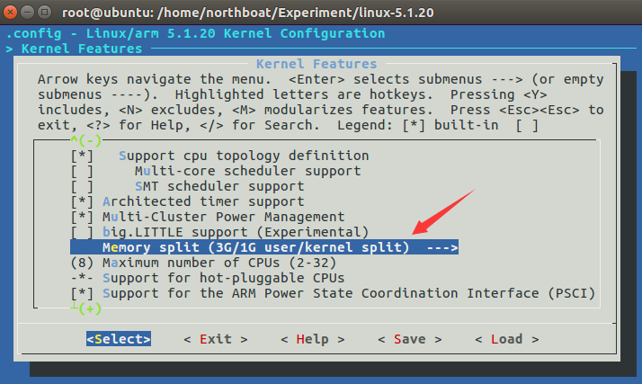

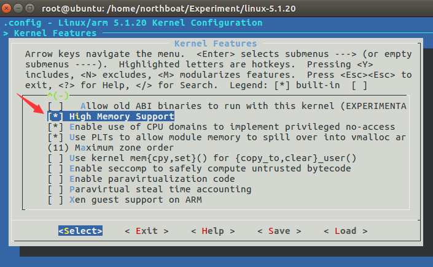

编译内核

```bash
make bzImage ARCH=arm CROSS_COMPILE=arm-linux-gnueabi-
```

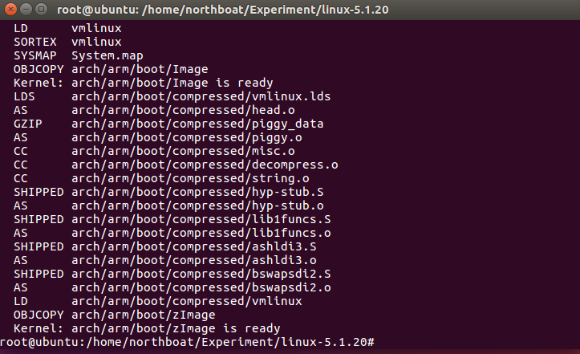

编译生成 dtb 文件

```bash
make dtbs
```

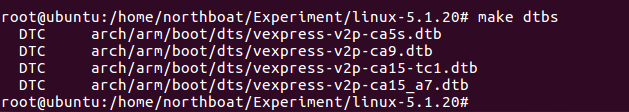

#### 运行 QEMU

在编译好的 linux 内核根目录下执行

```bash
qemu-system-arm -M vexpress-a9 -m 256M -kernel arch/arm/boot/zImage -append "rdinit=/linuxrc console=ttyAMA0 loglevel=8" -dtb arch/arm/boot/dts/vexpress-v2p-ca9.dtb -nographic 
```

以上命令中参数含义如下

- -M：指定硬件芯片框架
- -m：指定运行内存大小
- -kernel：指定运行的内核镜像
- -dtb：指定具体芯片的配置信息
- -nographic：指定不使用图形界面

成功进入内核命令行

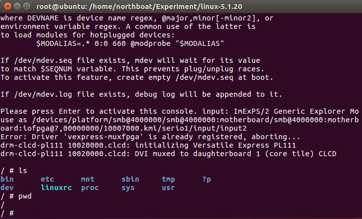

### 实验总结

通过手动编译 Linux 内核模块，以及通过 qemu 启动手动编译内核，使我明白了 Linux 的起源，以及对操作系统埋下了浓厚的兴趣，大量的`.c`及`.s`代码构成了庞大 Linux 的核心部件

##  Linux 内核模块

### 实验环境

Vmware 虚拟机，Ubuntu16

```bash
Linux ubuntu 4.15.0-112-generic #113~16.04.1-Ubuntu SMP Fri Jul 10 04:37:08 UTC 2020 x86_64 x86_64 x86_64 GNU/Linux
```

### 实验内容

#### 编写一个简单的内核模块

编写模块程序：hello_module.c

```c
#include <linux/module.h>
#include <linux/kernel.h>
#include <linux/init.h>

static int __init hello_init(void){
	printk("This is hello_module, welcome to Linux kernel \n");
return 0;
}
static void __exit hello_exit(void){
	printk("see you next time!\n");
}

module_init(hello_init);
module_exit(hello_exit);
MODULE_LICENSE("GPL");
MODULE_AUTHOR("Mr Yu");
MODULE_DESCRIPTION("hello kernel module");
MODULE_ALIAS("hello"); 
```

编译内核模块：编写`Makefile`文件

```makefile
obj-m := hello_module.o
KERNELBUILD := /lib/modules/$(shell uname -r)/build
CURRENT_PATH := $(shell pwd)
all:
	make -C $(KERNELBUILD) M=$(CURRENT_PATH) modules
clean:
	make -C $(KERNELBUILD) M=$(CURRENT_PATH) clean
```

编译：将`hello_module.c`和`Makefile`放在同一目录做

```bash
make
```

得到`hello_module.ko`文件

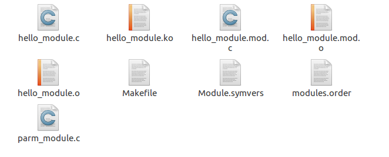

检查编译模块：通过`file`命令检查编译模块是否正确

```bash
file hello_module.ko
```

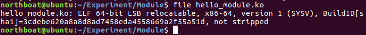

插入模块：通过`insmod`命令插入模块

```bash
insmod hello_module.ko
```

完成插入后使用`lsmod`命令查看当前模块是否被加载到系统中

```bash
lsmod
```

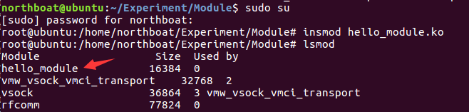

在`/sys/modules`目录下会有以模块名命名的目录

```bash
ls /sys/module
```

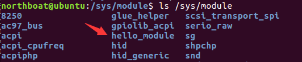

查看输出：通过`tail /var/log/messages`或`dmesg`命令查看输出结果

```bash
tail /var/log/message
dmesg
```


卸载模块：通过`rmmod`命令卸载模块

```bash
rmmod hello_module
```

通过`dmesg`命令查看结果

```bash
dmesg
```

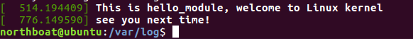

#### 编写带参模块

Linux 内核提供一个宏来实现模块的参数传递

编写模块代码：parm_module.c

```c
#include <linux/module.h>
#include <linux/kernel.h>
#include <linux/init.h>

static int debug = 1;
module_param(debug, int, 0644);
MODULE_PARM_DESC(debug, "debugging information");
#define dprintk(args...) if(debug){printk(KERN_DEBUG args);}
static int myparm = 10;
module_param(myparm, int, 0644);
MODULE_PARM_DESC(myparm, "kernel module parameter experiment.");

static int __init parm_init(void){
	dprintk("my linux kernel module init.\n");
	dprintk("module parameter = %d\n", myparm);
	return 0;
}
static void __exit parm_exit(void){
	printk("see you next time!\n");
}

module_init(parm_init);
module_exit(parm_exit);
MODULE_LICENSE("GPL");
MODULE_AUTHOR("Mr Yu");
MODULE_DESCRIPTION("kernel module paramter experiment");
MODULE_ALIAS("myparm");
```

修改`Makefile`文件，编译并插入模块

Makefile

```makefile
obj-m := parm_module.o
KERNELBUILD := /lib/modules/$(shell uname -r)/build
CURRENT_PATH := $(shell pwd)
all:
	make -C $(KERNELBUILD) M=$(CURRENT_PATH) modules
clean:
	make -C $(KERNELBUILD) M=$(CURRENT_PATH) clean 
```

make

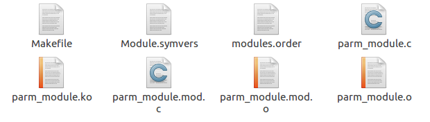

插入

```bash
insmod parm_module.ko
```

通过 dmesg 查看日志信息，可发现输出以上程序中 myparm 的默认值

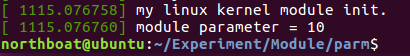

卸载模块

```bash
rmmod parm_module
```

赋值重新加载模块，修改参数`myparm`值为 100

```bash
insmod parm_module.ko myparm=100
```

通过 dmesg 查看日志信息，可发现 myparm 值已经改变

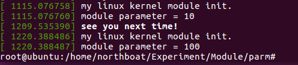

### 实验总结

通过内核模块的编写以及插入使用，使我对 Linux 的 Freedom 理念理解得更加深刻，同时对 linux c 编程有了更深入的理解

## Linux 内存管理

### 实验环境

Vmware 虚拟机，Ubuntu16，

```bash
Linux ubuntu 4.15.0-112-generic #113~16.04.1-Ubuntu SMP Fri Jul 10 04:37:08 UTC 2020 x86_64 x86_64 x86_64 GNU/Linux
```

### 实验内容

> virtual  memory areas，VMA

本实验内容编写一个内核模块，遍历一个用户进程中所有的 VMA，并且打印 这些 VMA 的属性信息，如 VMA 的大小、起始地址等，并通过与`/proc/pid/maps`中显示的信息进行对比验证 VMA 信息是否正确

#### 编写并编译模块程序

vma_test.c

```c
#include <linux/module.h> 
#include <linux/init.h> 
#include <linux/mm.h> 
#include <linux/sched.h> 
 
static int pid; 
module_param(pid, int, 0644); 
 
static void printit(struct task_struct *tsk) { 
	struct mm_struct *mm; 
	struct vm_area_struct *vma; 
 	int j = 0; 
 	unsigned long start, end, length; 
 
	mm = tsk->mm; 
	pr_info("mm_struct addr = 0x%p\n", mm); 
 	vma = mm->mmap; 

	/* 使用 mmap_sem 读写信号量进行保护 */ 
	down_read(&mm->mmap_sem); 
	pr_info("vmas: vma start end length\n");
    
 	while (vma) { 
 		j++; 
  		start = vma->vm_start; 
 		end = vma->vm_end; 
 		length = end - start; 
 		pr_info("%6d: %16p %12lx %12lx %8ld\n", 
 				j, vma, start, end, length); 
 		vma = vma->vm_next; 
 	}
	up_read(&mm->mmap_sem); 
} 

static int __init vma_init(void) { 
 	struct task_struct *tsk; 
 	/* 如果插入模块时未定义 pid 号，则使用当前 pid */ 
 	if (pid == 0) { 
 		tsk = current; 
 		pid = current->pid; 
 		pr_info("using current process\n"); 
    } else { 
		tsk = pid_task(find_vpid(pid), PIDTYPE_PID); 
	} 
	if (!tsk) 
		return -1; 
	pr_info(" Examining vma's for pid=%d, command=%s\n", pid, tsk->comm); 
	printit(tsk); 
	return 0; 
} 

static void __exit vma_exit(void) { 
	pr_info("Module exit\n"); 
}

module_init(vma_init); 
module_exit(vma_exit); 
MODULE_LICENSE("GPL"); 
MODULE_AUTHOR("Mr Yu"); 
MODULE_DESCRIPTION("vma test"); 
```

编译内核模块

编写 Makefile

```makefile
obj-m := vma_test.o 

KERNELBUILD := /lib/modules/$(shell uname -r)/build 
CURRENT_PATH := $(shell pwd) 
 
all: 
	make -C $(KERNELBUILD) M=$(CURRENT_PATH) modules 
clean: 
	make -C $(KERNELBUILD) M=$(CURRENT_PATH) clean 
```

使用 make 命令编译，得到`vma_test.ko`文件

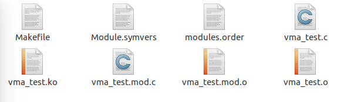

#### 插入模块

通过 top 命令随便获取一个进程号

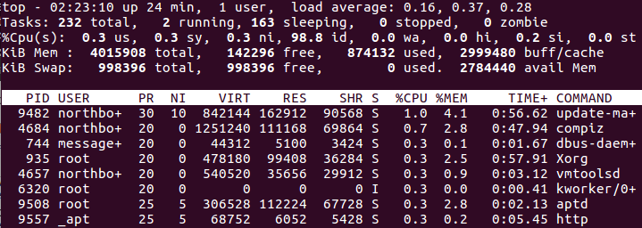

这里选择`Xorg`的进程号`935`，使用 insmod 命令插入模块并传参

```bash
insmod vma_test.ko 935
```

#### 查看程序打印信息

使用 dmesg 查看信息

```bash
dmesg
```

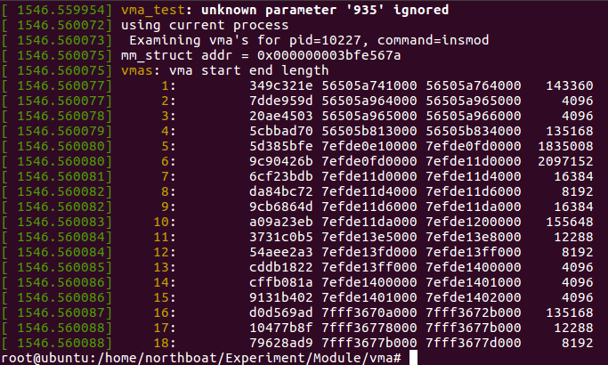

从 proc 虚拟文件系统中查看进程第一个 VMA 的信息

```bash
cat /proc/935/smaps
```

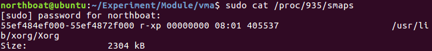

通过对比发现第一块内存区域地址起始位置一致，说明程序输出信息正确

### 实验总结

通过内核模块程序查看 VMA，使我对 linux 内核模块编写能力提升，并且对 linux 的内存管理理解更加深刻

## Linux 设备驱动 

### 实验环境

Vmware 虚拟机，Ubuntu16，

```bash
Linux ubuntu 4.15.0-112-generic #113~16.04.1-Ubuntu SMP Fri Jul 10 04:37:08 UTC 2020 x86_64 x86_64 x86_64 GNU/Linux
```

### 实验内容

#### 编写驱动程序

mycdev_driver.c

```c
#include <linux/module.h>
#include <linux/kernel.h>
#include <linux/init.h>
#include <linux/types.h>
#include <linux/fs.h>
#include <linux/mm.h>
#include <linux/sched.h>
#include <linux/cdev.h>
#include <asm/io.h>
#include <asm/switch_to.h>
#include <asm/uaccess.h>
#include <linux/errno.h>
#include <linux/uaccess.h>

#define MYCDEV_MAJOR 300  /*主设备号，通过cat /proc/devices 查询，选择未使用的设备号*/
#define MYCDEV_SIZE 1024


static int mycdev_open(struct inode *inode, struct file *fp){
	return 0;
}

static int mycdev_release(struct inode *inode, struct file *fp){
	return 0;
}

/*实现read程序*/
static ssize_t mycdev_read(struct file *fp, char __user *buf, size_t size, loff_t *pos){
	unsigned long p = *pos;
	unsigned int count = size;
	char kernel_buf[MYCDEV_SIZE] = "This is mycdev driver!";
	int i;
	
	if(p >= MYCDEV_SIZE)
		return -1;
	if(count > MYCDEV_SIZE)
		count = MYCDEV_SIZE - p;
	if(copy_to_user(buf, kernel_buf, count) != 0){
		printk("read error!\n");
		
		return -1;
	}
	
	printk("reader: %d bytes was read.\n", count);
	
	return size;
}

/*实现write程序*/
static ssize_t mycdev_write(struct file *fp, const char __user *buf, size_t size, loff_t *pos){
	return size;
}

/*填充file operations结构*/
static const struct file_operations mycdev_fops = {
	.owner = THIS_MODULE,
	.open = mycdev_open,
	.release = mycdev_release,
	.read = mycdev_read,
	.write = mycdev_write,
};


/*模块初始化函数*/
static int __init mycdev_init(void){
	printk("mycdev driver is now starting!\n");
	
	/*注册驱动程序*/
	int ret = register_chrdev(MYCDEV_MAJOR, "my_cdev_driver", &mycdev_fops);
	
	if(ret < 0){
		printk("register failed!\n");
		return 0;
	}else{
		printk("register successfully!\n");
	}
	
	return 0;
}

/*卸载模块函数*/
static void __exit mycdev_exit(void){
	printk("mycdev driver is now leaving!\n");
	unregister_chrdev(MYCDEV_MAJOR, " ");
}

module_init(mycdev_init);
module_exit(mycdev_exit);

MODULE_LICENSE("GPL");
```

#### 编译并插入模块

Makefile

```makefile
obj-m := mycdev_driver.o
KERNELBUILD := /lib/modules/$(shell uname -r)/build
CURRENT_PATH := $(shell pwd)
all:
	make -C $(KERNELBUILD) M=$(CURRENT_PATH) modules
clean:
	make -C $(KERNELBUILD) M=$(CURRENT_PATH) clean 
```

编译并插入模块

```bash
sudo make
insmod mycdev_driver.ko
```

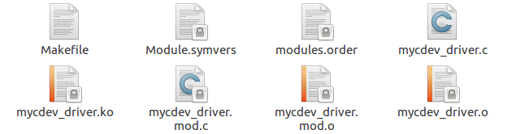

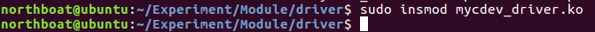

#### 创建文件设备节点

创建文件节点并修改文件权限

```bash
sudo mknod /dev/mycdev c 300 0
sudo chmod 777 /dev/mycdev 
```

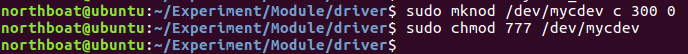

#### 编写测试程序并执行

test.c

```c
#include <stdio.h> 
#include <sys/types.h> 
#include <sys/stat.h> 
#include <fcntl.h> 
#include <stdlib.h> 
 
int main() { 
 	int testdev; 
	char buf[10]; 
 	testdev = open("/dev/mycdev", O_RDWR); 
	if(testdev == -1){ 
		printf("open file failed!\n"); 
		exit(1); 
	} 
	//将 testdev 所指的文件读 10 个字节到 buf 中 
	if(read(testdev, buf, 10) < 10){ 
		printf("Read error!\n"); 
		exit(1); 
	} 
	for(int i = 0; i < 10; i++) 
		printf("%d\n", buf[i]); 
	close(testdev); 
 	return 0; 
}
```

编译并执行

```bash
sudo gcc test.c -o test
./test
```

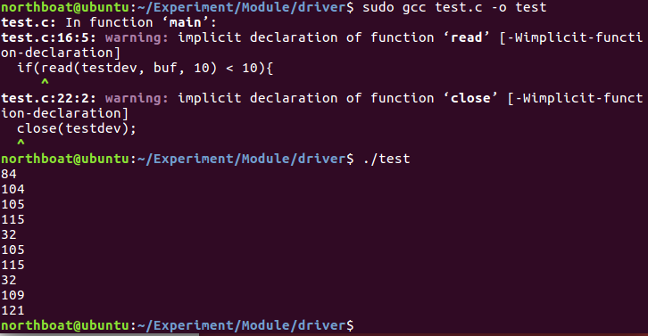

#### 查看日志信息

通过 dmesg 命令查看

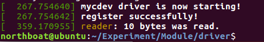

### 实验总结

Linux 内核根据各类设备抽象出一套完整的驱动框架和 API 接口，以便驱动开发者在编写驱动程序时可重复使用，通过调用 Linux 驱动 API，使我对 Linux 的驱动开发有了基础的理解，对 Linux 操作系统也有了更细致的了解
