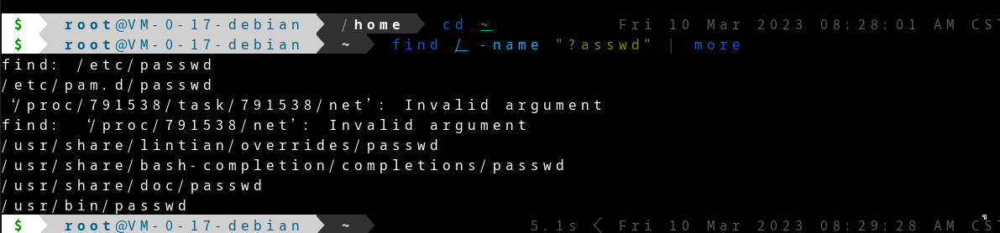
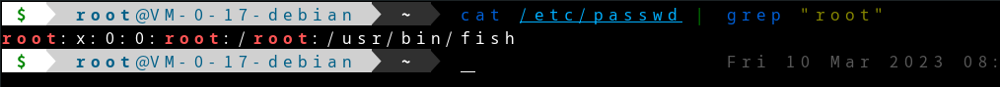
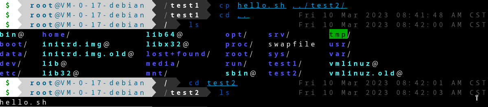
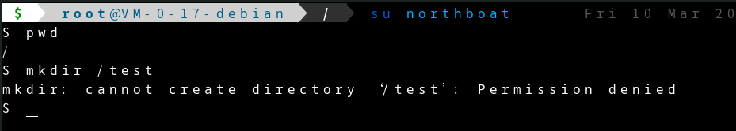
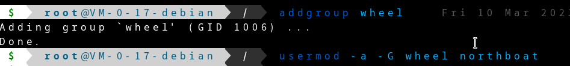
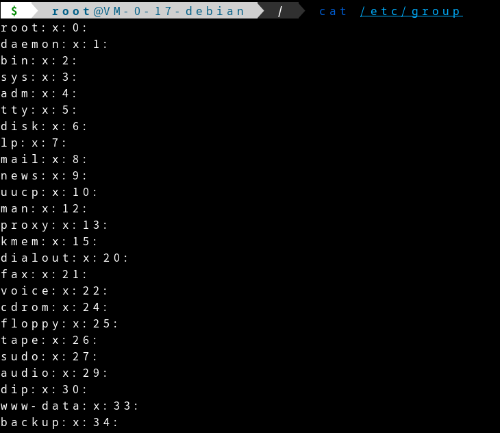
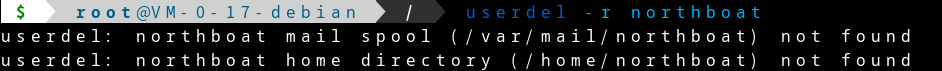
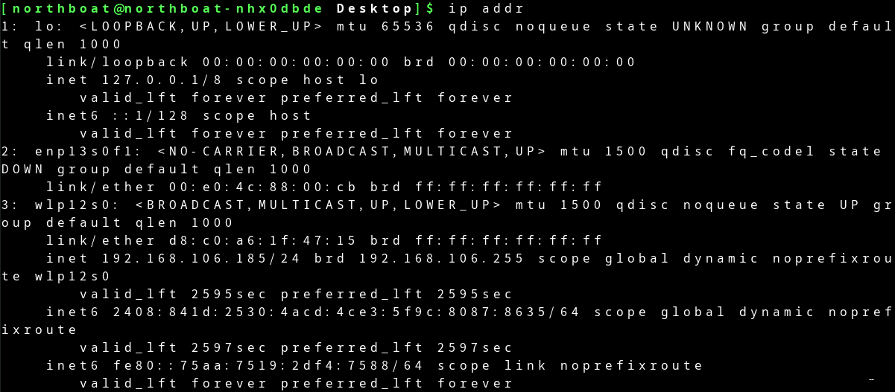
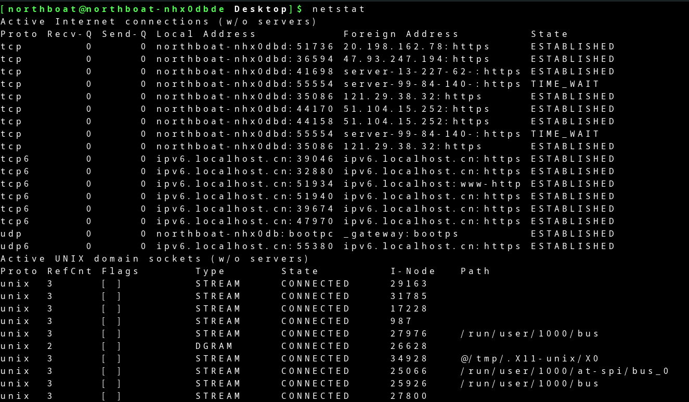

| 学院       | 计算机与通信工程学院 |
| ---------- | -------------------- |
| **专业**   | **计算机科学与技术** |
| **班级号** | **200523**           |
| **学号**   | **202012143**        |
| **姓名**   | **熊舟桐**           |


# <center> Linux 操作系统及内核分析实验报告

## Linux 基本命令

### 实验环境

Linux 版本

```bash
Linux northboat-nhx0dbde 6.1.12-1-MANJARO #1 SMP PREEMPT_DYNAMIC Tue Feb 14 21:59:10 UTC 2023 x86_64 GNU/Linux
```

ssh 版本

```bash
OpenSSH_9.2p1, OpenSSL 3.0.8 7 Feb 2023
```

目标机版本

```bash
Linux VM-0-17-debian 5.10.0-19-amd64 #1 SMP Debian 5.10.149-2 (2022-10-21) x86_64 GNU/Linux
```

### 实验内容

#### ssh 连接 Linux

在`manjaro`上连接`debian`服务器

```bash
ssh root@43.163.218.127
```

查看主机基本信息


查看网卡信息


#### 文件管理命令

搜索文件



查看文件内容


通过管道过滤查找关键字



创建目录


创建文本文件


编辑文件


复制文件



删除文件


删除目录


#### 用户管理

新建用户


切换并测试用户




修改用户权限



查看用户组



删除用户



#### 文件解压缩

压缩文件`.tar`


解压文件


压缩文件`.tar.gz`


解压文件


### 实验总结

debain 默认没有 wheel 组，在加入用户进 wheel 组时会报错：group wheel does not exist

需要新增组

```bash
groupadd wheel
```

再将用户加入组

```bash
usermod -a -G wheel northboat
```

删除组

```bash
groupdel wheel
```

通过查看组`cat /etc/group`发现存在`root`组，将用户加入`root`组

```bash
usermod -a -G root northboat
```

## Linux 系统管理

### 实现环境

Linux 版本

```bash
Linux northboat-nhx0dbde 6.1.12-1-MANJARO #1 SMP PREEMPT_DYNAMIC Tue Feb 14 21:59:10 UTC 2023 x86_64 GNU/Linux
```

本地 Shell

### 实验内容

#### Linux 网络管理

> 设置静态 IP，manjaro 下，使用 netctl 实现

下载 netctl

```bash
yay -S netctl
```

查看网卡信息



得知网卡名称`enp13s0f1`

终止网络服务

```bash
sudo systemctl stop NetworkManager
sudo systemctl disable NetworkManager
```

复制`netctl`默认配置文件

```bash
sudo cp /etc/netctl/examples/ethernet-static /etc/netctl/enp13s0f1
```

编辑文件`enp13s0f1`


配置 DNS 解析


重启网络服务

```bash
sudo systemctl start NetworkManager
sudo systemctl enable NetworkManager
```

查看网络连接状态



#### 进程管理

`ps`命令查看进程


查看所有用户所有进程信息


进程信息排序

- 按内存占用


- 按 CPU 占用


动态查看进程信息


终止进程

```bash
# 根据 pid 杀死进程
kill -9 pid

# 根据进程名查找 pid
pgrep -f name

# 根据进程名杀死进程
pkill -f name
```

#### 磁盘管理

查看已挂载磁盘总容量、已使用、剩余容量


查看目录或文件所占空间


### 实验总结

修改静态 IP 可以方便局域网内对本机进行访问，感觉用处不大，之前使用系统提供的配置文件对静态 IP 进行过修改，但每次重启或重新联网后都会重置该 IP，后采用`netctl`对静态 IP 进行统一管理，解决了问题

