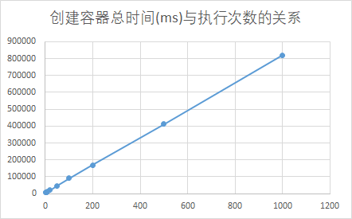
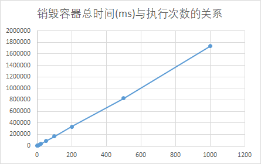
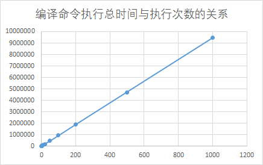
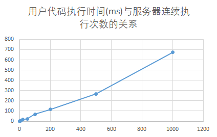

<center><h1>Linux操作系统及内核分析结课论文</h1></center><br><br>

| <center>学院       | <center>计算机与通信工程学院 |
| ------------------ | ---------------------------- |
| <center>**专业**   | <center>**计算机科学与技术** |
| <center>**班级号** | <center>**200523**           |
| <center>**学号**   | <center>**202012143**        |
| <center>**姓名**   | <center>**熊舟桐**           |

# <center>基于Docker容器技术沙盒测试的研究 

## 摘要

本文针对传统软件测试方法存在的一些局限和不足，探讨了基于docker容器的沙盒测试技术，并运用该技术进行了实验。具体来说，本文梳理了软件测试的发展历程和一些现行的测试方法，分析了这些方法的优缺点。进而，本文介绍了docker容器技术的基本概念和特点，重点讨论了如何在docker容器中搭建一个适合于测试用的沙盒环境，并阐述了这种技术的优势。 在实验部分，本文通过实际online judge应用场景，比较了使用传统测试方法与基于docker容器的沙盒测试方法的优劣。实验结果表明，基于docker容器的沙盒测试方法具有较高的测试效率和测试精度，更能在测试中检测出异常信息，从而提高测试准确性。 综上所述，本文从软件测试的实际应用需求出发，提出并验证了基于docker容器技术的沙盒测试方法，为软件测试提供了一种高效、精准的测试手段。

## 沙盒测试概述

### 什么是沙盒测试

沙盒测试（sandbox testing）是一种软件测试方法，它使用隔离环境来模拟实际生产环境，以便在不影响生产环境的情况下测试软件应用程序的功能和性能。通常情况下，沙盒测试是在独立的测试环境中进行的，可以模拟真实环境中的各种条件和情况，如网络延迟、资源限制等，以验证应用程序的可靠性、稳定性和安全性。

沙盒测试的目的是在软件发布之前发现和解决潜在的问题和缺陷，以确保应用程序在生产环境中的顺利运行。与传统的单元测试、集成测试和功能测试不同，沙盒测试更加注重模拟真实环境中的各种条件和情况，如网络连接的中断、硬件故障等，以验证应用程序在这些情况下的行为和响应。

在沙盒测试中，开发人员通常会使用虚拟机、容器或其他隔离环境来模拟生产环境，以便在测试过程中进行实验和验证。此外，沙盒测试也可以用于测试新功能或更新的软件应用程序，以确保它们与现有系统的兼容性。

沙盒测试是一种非常有用的测试方法，它可以帮助开发人员在不影响生产环境的情况下测试软件应用程序的功能和性能，从而提高应用程序的质量和可靠性。

### Docker和沙盒测试

Docker可以用来进行沙盒测试，这是Docker的一个重要应用场景之一。通过Docker，我们可以创建一个独立的运行环境，将应用程序和其依赖的库和组件打包成一个Docker镜像，并在容器中运行这个镜像。这样，我们就可以在一个独立的、隔离的环境中测试应用程序，而不会影响到本地机器的其他环境。

具体来说，可以使用Docker Compose定义测试环境，并在其中配置需要测试的应用程序和相应的测试工具。在测试环境中，可以运行各种自动化测试工具，如单元测试、集成测试等，以及其他测试工具，如代码覆盖率工具、性能测试工具等。

使用Docker进行沙盒测试有以下优点：

1. 环境隔离性：Docker容器提供了隔离的运行环境，可以防止测试过程中对本地机器产生影响。
2. 快速部署：Docker容器可以很容易地部署到各种环境中，包括本地机器、云服务器等，可以快速建立测试环境。
3. 资源利用率高：Docker容器的运行资源占用更小，可以更好地利用本地机器的资源。
4. 可重复性好：Docker容器提供了可重复的测试环境，可以确保测试结果的一致性和可靠性。
5. 易于维护：使用Docker Compose可以很方便地管理测试环境的构建和维护，可以快速更新测试环境。

使用Docker进行沙盒测试可以提高测试效率和质量，同时降低测试成本和风险。

## 虚拟化技术概述

### 传统虚拟化技术

Linux虚拟化技术指的是在Linux操作系统上实现虚拟化的技术。虚拟化技术可以将一台物理机器划分成多个虚拟机，每个虚拟机可以运行不同的操作系统和应用程序，并且彼此之间相互隔离，就好像它们是独立的物理机器一样。虚拟化技术可以有效地利用硬件资源，提高系统的灵活性、可靠性和安全性。

常用的Linux虚拟化技术包括：

1. KVM（Kernel-based Virtual Machine）：KVM是一种基于Linux内核的虚拟化技术，它可以将Linux作为宿主机器，在其上运行多个虚拟机。KVM使用硬件虚拟化扩展来提高性能，并且支持多种操作系统和应用程序。
2. Xen：Xen是一种基于虚拟机监控器（hypervisor）的虚拟化技术，它可以将一台物理机器划分成多个虚拟机，每个虚拟机可以运行不同的操作系统和应用程序。Xen使用硬件虚拟化扩展来提高性能，并且支持多种操作系统和应用程序。
3. LXC（Linux Containers）：LXC是一种基于容器的虚拟化技术，它可以在Linux操作系统上创建多个独立的用户空间环境，每个环境都拥有自己的文件系统、进程和网络接口，并且可以运行不同的应用程序。LXC不需要虚拟机监控器，因此性能较高，但隔离性可能不如硬件虚拟化技术。
4. Docker：Docker是一种基于容器的虚拟化技术，它可以在Linux操作系统上创建多个独立的容器，每个容器都拥有自己的文件系统、进程和网络接口，并且可以运行不同的应用程序。Docker不需要虚拟机监控器，因此性能较高，但隔离性可能不如硬件虚拟化技术。

在工业上，Linux虚拟化技术可以帮助企业节省硬件成本、提高系统的灵活性、可靠性和安全性，因此得到了广泛的应用。

### Docker容器化技术

Docker容器采用了一种名为“容器化”的技术，它使得应用程序能够在一个独立的、封闭的容器中运行，与其他容器和主机系统隔离开来。容器化可以有效地解决应用程序之间的依赖冲突和环境配置问题，同时也提高了应用程序的可移植性和可扩展性。

Docker容器的优点包括：

1. 隔离性：Docker容器与其他容器和主机系统隔离开来，可以避免应用程序之间的依赖冲突和环境配置问题。
2. 可移植性：Docker容器可以在任何Docker支持的平台上运行，包括本地计算机、云平台和虚拟化平台等。
3. 可扩展性：Docker容器可以通过增加容器数量来实现应用程序的扩展性，同时也可以通过使用Docker Swarm等工具来管理和协调多个容器。
4. 易于管理：Docker容器可以使用Docker命令行工具和图形化界面来管理和部署，同时也可以使用Docker Compose等工具来进行复杂的容器编排和管理。
5. 轻量级：Docker容器相对于传统的虚拟机来说，非常轻量级，启动和停止速度很快，可以提高应用程序的响应速度和性能。

Docker容器是一种轻量级的虚拟化技术，它可以将应用程序及其依赖项打包在一个独立的、可移植的容器中，提高了应用程序的可移植性、可扩展性和管理性。

传统的虚拟机技术和Docker容器有以下区别：

1. 资源占用：传统虚拟机需要模拟完整的硬件环境，因此会占用大量资源，包括内存、CPU等，而Docker容器则是共享主机操作系统的资源，因此对资源的占用更小。
2. 启动时间：传统虚拟机需要启动整个操作系统，因此启动时间相对较长，而Docker容器由于共享主机操作系统的内核，因此启动时间更短。
3. 系统支持：传统虚拟机可以在不同的操作系统上运行，而Docker容器需要在支持Docker引擎的Linux系统上运行。
4. 部署方式：传统虚拟机需要将完整的虚拟机镜像部署到目标主机上，而Docker容器只需要将容器镜像部署到目标主机上即可。
5. 隔离性：传统虚拟机提供了完整的虚拟化，因此可以实现更加严格的隔离性，而Docker容器的隔离性相对较弱。

总之，传统虚拟机和Docker容器都有各自的优缺点，在具体应用场景中需要根据实际情况选择

## Docker容器和OJ平台

基于Docker的沙盒测试技术，可以实现一个Online Judge平台。这个平台可以用来为编程竞赛和在线编程提供一个安全、高效和可扩展的环境，让用户能够提交代码，并在线上执行、编译和测试代码，最终得到相应的结果和反馈。

下面是我们小组基于Docker的Online Judge平台的实现方案：

1. 构建Docker镜像：根据所需的编程语言和环境，构建相应的Docker镜像。这个镜像应该包含所需的编译器、库、组件和工具等。可以使用Dockerfile文件进行自动化构建。
2. 提交代码：用户在平台上提交自己的代码，并选择相应的编译器和测试用例。这个代码会被打包成一个Docker容器，然后上传到平台的服务器中。
3. 执行代码：平台的服务器会启动一个新的Docker容器，将用户提交的代码和测试用例放入容器中，并执行代码。在执行代码的过程中，服务器会对容器的资源进行限制，以保证安全性和稳定性。
4. 检查结果：在代码执行完成后，服务器会从容器中获取结果和反馈信息，并将它们返回给用户。这个结果可以包括编译错误、运行错误、超时等。
5. 统计分数：根据用户提交的代码和测试用例，平台会计算出相应的分数和排名，并将它们显示给用户。

在理论上，按照上述步骤，可以实现一个基于Docker的Online Judge平台，提供一个安全、高效和可扩展的环境，让用户能够提交代码，并在线上执行、编译和测试代码，最终得到相应的结果和反馈。

## Java实现及测试结果

> GitHub仓库：[Northboat | 在线判题系统](https://github.com/northboat/MyOJ)
>
> 文档：[基于 Docker 的在线判题平台 | Northboat Docs](https://northboat.netlify.app/dev/java/project/oj.html)

使用 java docker-client 包远程调用服务器 docker，共享本地文件夹代码，批量执行用户代码进行沙盒测试，记录创建容器和执行次数之间关系以及代码执行效率在长时间高强度运行下的影响

### 核心代码实现

DockerRunner.java

```java
package com.oj.neuqoj.docker.impl;

import com.oj.neuqoj.docker.Runner;
import com.oj.neuqoj.vo.JudgeRequest;
import com.spotify.docker.client.DefaultDockerClient;
import com.spotify.docker.client.DockerCertificates;
import com.spotify.docker.client.DockerClient;
import com.spotify.docker.client.LogStream;
import com.spotify.docker.client.exceptions.DockerException;
import com.spotify.docker.client.messages.*;

import java.io.File;
import java.io.IOException;
import java.net.URI;
import java.nio.file.Paths;
import java.util.*;
import java.util.concurrent.Callable;

// 10730 gcc:7.3 |  20800 openjdk:8 | 21100 openjdk:11 | 30114 golang:1.14
public class DockerRunner implements Runner, Callable<Map<String, Object>> {

    public static final String DOCKER_CONTAINER_WORK_DIR = "/usr/codeRun";
    private static Map<Integer, String> imageMap = new HashMap<>();
    private DockerClient docker;
    // private List<Image> Images;

    private static final int coreContainerSize = 9;
    private static final int maximumContainerSize = 12;
    //请求队列，当容器不够时排队
    private static Deque<JudgeRequest> requestQueue;
    //{服务器1: {镜像类型1: List容器ID, 镜像类型2: List容器ID...}, 服务器2:...}
    private static Map<Integer, Map<String, List<String>>> dockerContainerList;

    static{
        imageMap.put(25695, "hello-world:latest");
        imageMap.put(10730, "gcc:7.3");
        imageMap.put(20800, "openjdk:8");
        imageMap.put(21100, "openjdk:11");
        //imageMap.put(30114, "golang:1.14");
        imageMap.put(10520, "python:3.6.6");

        requestQueue = new LinkedList<>();

        dockerContainerList = new HashMap<>();
        dockerContainerList.put(0, new HashMap<>());
        dockerContainerList.put(1, new HashMap<>());
        dockerContainerList.put(2, new HashMap<>());
    }


    public void offer(String name, String[][] commandLine, int imageType, long memoryLimit){
        requestQueue.offer(new JudgeRequest(name, commandLine, imageType, memoryLimit));
    }


    //只轮询了Docker服务器，返回容器id
    //应该根据容器数量进行动态判断，若有空闲容器直接返回其id
    private static int pollingCount = 0;
    public ContainerCreation dockerPolling(String type) throws DockerException, InterruptedException {
        //设置容器属性
        //让容器持续开启
        //添加卷
        //设置docker工作卷
        ContainerConfig containerConfig = ContainerConfig.builder()
                //让容器持续开启
                .openStdin(true)
                //添加卷
                .addVolume(DOCKER_CONTAINER_WORK_DIR)
                //设置docker工作卷
                .workingDir(DOCKER_CONTAINER_WORK_DIR)
                .image(type)
                .build();
        ContainerCreation creation = null;
        int count = 0;
        while(true){
            if(pollingCount%3 == 0){
                try{
                    //System.out.println("hahaha");
                    docker = DefaultDockerClient.builder()
                            //证书连接
                            .uri(URI.create("https://39.106.160.174:2375"))
                            //服务器路径：/java/certs
                            //windows路径：C:\Files\java\javaee\my-oj\Certs
                            .dockerCertificates(new DockerCertificates(Paths.get("C:\\Files\\java\\javaee\\my-oj\\Certs")))
                            .build();
                    creation = docker.createContainer(containerConfig);
                    break;
                }catch (Exception e){
                    e.printStackTrace();
                    pollingCount++;
                    if(++count >= 3){ throw new RuntimeException("Docker连接失败"); }
                }
            }
            if(pollingCount%3 == 1){
                try{
                    docker = DefaultDockerClient.builder()
                            //直接连接
                            .uri(URI.create("http://144.24.68.12:2375"))
                            .build();
                    creation = docker.createContainer(containerConfig);
                    break;
                }catch (Exception e){
                    pollingCount++;
                    if(++count >= 3){ throw new RuntimeException("Docker连接失败"); }
                }
            }
            if(pollingCount%3 == 2) {
                try{
                    docker = DefaultDockerClient.builder()
                            //直接连接
                            .uri(URI.create("http://110.42.161.162:2375"))
                            .build();
                    creation = docker.createContainer(containerConfig);
                    break;
                }catch (Exception e){
                    pollingCount++;
                    if(++count >= 3){ throw new RuntimeException("Docker连接失败"); }
                }
            }
        }

        //System.out.println(pollingCount++);
        return creation;
    }

    //是否有空闲容器
    public boolean containerAvailable(int num, String type) throws DockerException, InterruptedException {
        if(dockerContainerList.get(num).get(type).size() < coreContainerSize){
            return false;
        }
        for(String id: dockerContainerList.get(num).get(type)){
            if(!docker.inspectContainer(id).state().running()){
                return true;
            }
        }
        return false;
    }

    //初始化容器
    public long init(int type, JudgeRequest params) {
        //一开始为了测试时间，该函数返回类型为long
        long start = System.currentTimeMillis();
        System.out.println("开始初始化docker");
        String id = null;
        int size = maximumContainerSize;
        String imageType = imageMap.get(type);
        try{

            //开始创建容器
            System.out.println("开始创建docker_container");
            //初始化docker代理、开启容器，轮询初始化，遇错先向后轮询，若全报错则直接抛出错误
            //通过轮询获取容器
            ContainerCreation creation = dockerPolling(imageType);

            System.out.println(docker.info());

            //记录容器id
            // id = polling(imageType).id();
            id = creation.id();
            params.setContainerId(id);

            //dockerContainerList.get((pollingCount-1)%3).get(imageType).add(id);

            // 获取容器信息
            // final ContainerInfo info = docker.inspectContainer(id);
            // System.out.println(info.toString());


            System.out.println("docker_container创建完毕");
            System.out.println("docker初始化成功");
        }catch (Exception e) {
            e.printStackTrace();
        }
        long end = System.currentTimeMillis();
        return end-start;
    }

    //请求出队，在这个地方完成 容器id设置 一个请求对应一个id，根据容器数量决定新建还是用现成的，在init里面操作
    public JudgeRequest poll(){
        JudgeRequest cur = requestQueue.poll();
        if(cur == null){ throw new RuntimeException("线程混乱，请求队列已空"); }

        cur.setInitTime(init(cur.getImageType(), cur));

        return cur;
    }

    //停止容器：记录停止时间
    public long kill(String id){
        long startTime = System.currentTimeMillis();
        try{
            //停止容器
            docker.stopContainer(id, 0);
            System.out.println("停止容器成功");
            //移除容器
            docker.removeContainer(id);
            System.out.println("已移除容器");
            //关闭docker代理
            docker.close();
            System.out.println("docker代理已关闭");
        }catch(Exception e) {
            e.printStackTrace();
        }
        System.out.println("本次判题结束，正在返回结果...");
        long endTime = System.currentTimeMillis();
        return endTime - startTime;
    }


    @Override
    public Map<String, Object> call() throws Exception {
        return judge();
    }

    public Map<String, Object> judge() throws  InterruptedException,
                                IOException, DockerException, java.lang.NumberFormatException{
        JudgeRequest request = poll();

        Map<String, Object> res = new HashMap<>();

        res.put("initTime", request.getInitTime());
        String id = request.getContainerId();

        System.out.println(id);
        System.out.println(docker.info());

        //连接container
        System.out.println("连接容器");
        docker.startContainer(id);

        //将本地文件夹共享至容器内部
        docker.copyToContainer(new File
                //服务器路径：/java/oj/
                //本地路径: C:\Files\java\javaee\my-oj\Code-Src\
                ("C:\\Files\\java\\javaee\\my-oj\\Code-Src\\" + request.getName()).toPath(), id, "/usr/codeRun/");


        //开始在容器内部执行命令执行
        //编译java文件
        System.out.println("开始编译...");
        ExecCreation execCompile = docker.execCreate(
                id, request.getCommandLine()[0], DockerClient.ExecCreateParam.attachStdout(),
                DockerClient.ExecCreateParam.attachStderr());

        ExecState compileState = docker.execInspect(execCompile.id());
        //执行编译命令
        LogStream l = docker.execStart(execCompile.id());
        while(compileState.running()){};
        String compileOutput = l.readFully();

        if(compileOutput.equals("")){
            System.out.println("编译成功");
        } else {//编译错误
            System.out.println(compileOutput);
            res.put("status", 2);
            //截取编译信息，去掉头部java文件名
            res.put("compileInfo", compileOutput.substring(compileOutput.indexOf(":")+1));
            res.put("destroyTime", kill(id) + "ms");
            res.put("passNum", 0);
            return res;
        }


        //编译完成，执行class文件
        ExecCreation execCreation = docker.execCreate(
                id, request.getCommandLine()[1], DockerClient.ExecCreateParam.attachStdout(),
                DockerClient.ExecCreateParam.attachStderr());


        //获取命令的运行结果
        LogStream output = null;
        if(!compileState.running()){
            output = docker.execStart(execCreation.id());
        }
        String execOutput = output != null ? output.readFully() : "未知错误";


        //获取运行状态
        ExecState state = docker.execInspect(execCreation.id());


        //等待运行完成
        System.out.println("即将运行程序..");

        while(state.running()){};
        System.out.println("运行结束");

        //从打印信息execOutput种获取结果
        //System.out.println(execOutput);
        String[] info = execOutput.split("\n");
        //System.out.println(info[0]);
        int status = Integer.parseInt(info[0].trim());
        //System.out.println(status);

        //解答错误
        if(status == 3){
            res.put("status", status);
            res.put("passNum", info[1]);
            res.put("srcData", info[2]);
            res.put("realAns", info[3]);
            res.put("curAns", info[4]);
            res.put("destroyTime", kill(id) + "ms");
            return res;
        } else if(status == 4) {//超时
            res.put("status", status);
            res.put("passNum", info[1]);
            res.put("srcData", info[2]);
            res.put("timeLimit", info[3]);
            res.put("duration", info[4]);
            res.put("destroyTime", kill(id) + "ms");
            return res;
        } else {
            //System.out.println("hahaha");
            res.put("passNum", info[1]);
            res.put("averageTime", info[2]);
        }


        //在容器外，即服务器主机上执行shell命令 docker stats --no-stream --format "memory:{{.MemUsage}}" + 容器id，获取容器内存占用
        String memory = "0MiB";

        //超出内存限制
        if(Integer.parseInt(memory.substring(0, memory.indexOf("M"))) > request.getMemoryLimit()){
            res.put("status", 5);
            res.put("memoryLimit", request.getMemoryLimit());
            res.put("memoryUsage", memory);
            res.put("destroyTime", kill(id) + "ms");
        }else{//通过
            System.out.println("hahaha");
            res.put("status", 1);
            res.put("memoryUsage", memory);
            res.put("destroyTime", kill(id) + "ms");
        }

        return res;
    }

    public static void main(String[] args) {

        DockerRunner docker = new DockerRunner();

        Map<String, Object> res = docker.test(20800);

        //测试创建容器时间
        //long initTime = Integer.parseInt(res.get("创建容器时间").toString());
        //停止容器时间
        long stopTime = Integer.parseInt(res.get("关闭容器时间").toString());
        //编译命令执行时间
        long compileTime = Integer.parseInt(res.get("编译命令用时").toString());
        //执行命令执行时间
        long execTime = Integer.parseInt(res.get("执行命令用时").toString());
        //程序用时
        long runningTime = Integer.parseInt(res.get("程序用时").toString());
        //函数总用时
        long judgeTime = Integer.parseInt(res.get("本次判题总用时").toString());

        for (int i = 0; i < 0; i++) {
            Map<String, Object> temp = docker.test(20800);
            //initTime += Integer.parseInt(temp.get("创建容器时间").toString());
            stopTime += Integer.parseInt(temp.get("关闭容器时间").toString());
            compileTime += Integer.parseInt(temp.get("编译命令用时").toString());
            execTime += Integer.parseInt(temp.get("执行命令用时").toString());
            runningTime += Integer.parseInt(temp.get("程序用时").toString());
            judgeTime += Integer.parseInt(temp.get("本次判题总用时").toString());
            System.out.println("第" + (i+2) + "测试已完成");
        }

        //打印信息
        System.out.println("首次执行信息:");
        for(String str: res.keySet()){
            System.out.print(str + ": " + res.get(str) + "\t");
        }
        System.out.println("finished!");

    }

    //测试Docker运行时间
    public Map<String, Object> test(int imageType){
        long start = System.currentTimeMillis();
        Map<String, Object> res = new HashMap<>();
        String id = init(imageType);
        try{

            //启动container
            //docker.startContainer(id);


            //开始在容器内部执行命令执行
            System.out.println("正在执行命令...");

            //将文件拷贝至容器内部
            docker.copyToContainer(new java.io.File("C:\\Files\\java\\javaee\\my-oj\\Code-Src\\").toPath(), id, "/usr/codeRun/");


            //执行一道动态规划
            final String[] command1 = {"javac", "HelloWorld.java"};
            ExecCreation execCreation1 = docker.execCreate(
                    id, command1, DockerClient.ExecCreateParam.attachStdout(),
                    DockerClient.ExecCreateParam.attachStderr());

            final String[] command2 = {"java", "HelloWorld"};
            ExecCreation execCreation2 = docker.execCreate(
                    id, command2, DockerClient.ExecCreateParam.attachStdout(),
                    DockerClient.ExecCreateParam.attachStderr());

            //获取命令的运行结果
            final LogStream output1 = docker.execStart(execCreation1.id());
            final String execOutput1 = output1.readFully();

            //计算编译时间
            long compile = System.currentTimeMillis();
            res.put("编译命令用时", compile-start);


            final LogStream output2 = docker.execStart(execCreation2.id());
            final String execOutput2 = output2.readFully();
            //计算执行时间
            long exec = System.currentTimeMillis();
            res.put("执行命令用时", exec-compile);


            //获取运行状态
            final ExecState state1 = docker.execInspect(execCreation1.id());
            final ExecState state2 = docker.execInspect(execCreation2.id());

            //等待运行完成
            System.out.println("正在运行...");
            while(state1.running()){};
            while(state2.running()){};


            System.out.println("执行结束");

            System.out.println("运行结果: " + execOutput2);
            res.put("程序用时", execOutput2.substring(execOutput2.indexOf('\n')+1));
            long end = System.currentTimeMillis();
            res.put("本次判题总用时", end-start);

        }catch(Exception e) {
            e.printStackTrace();
        }finally {
            res.put("关闭容器时间", kill(id));
        }
        return res;
    }
}
```

### 测试结果

性能测试结果，服务器配置为 1 核 2 G 无显存，操作系统为 CentOS7.6









## 参考文献

[1]李芙玲,何灏贤.基于Docker实现在线评测系统的安全性[J].华北科技学院学报,2018,15(05):95-100.

[2]韦俊宇,王宇英.基于Docker的Online Judge容器设计与实现[J].大众科技,2022,24(09):14-17+13.

[3]方中纯,李海荣.基于Docker的大数据教学与实验平台的设计与实现[J].信息技术,2022,No.371(10):7-11.DOI:10.13274/j.cnki.hdzj.2022.10.002.

[4]何莉,孙雅妮,王海沛.“云化”新技术时代下的容器技术应用研究[J].电脑知识与技术,2021,17(22):133-135.DOI:10.14004/j.cnki.ckt.2021.2206.
